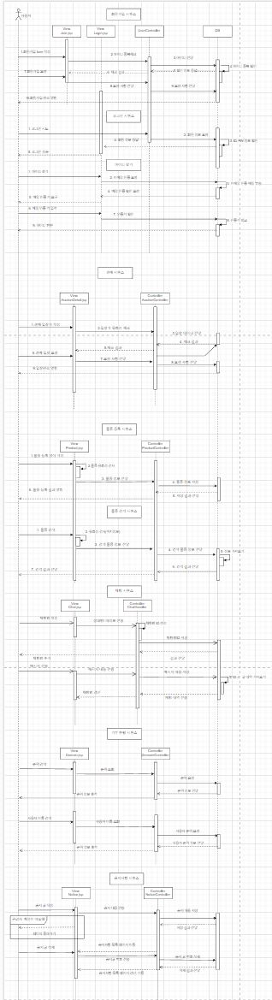

# 기부앤테이크, 근처의 물건을 찾아 경매부터 기부까지 
##### 팀원 : 신은규(조장), 이성준, 조은별, 하민호
## Contetns
1. [개요](#소개)
2. [설계의 주안점](#설계의-주안점)
3. [사용기술 및 개발환경](#사용기술-및-개발환경)
4. [주요기능](#주요기능)
5. [Document](#Document)
___
## 개요
- 필요 없어진 물건 팔아 수익과 기부를 동시에
- 경매 방식을 통해 내가 원하는 금액으로 물건 구매
___
## 설계의 주안점
1. **SHA256**을 이용한 비밀번호 암호화 저장
2. 회원가입시 **Postcodify**를 활용하여 사용자 위치 정보 지도에 표시, 비로그인 시 **geolocation**을 통해 대략적인 본인 위치 지정
3. 비밀번호 찾기와 환불요청 결과를 **JavaMail**를 통해 임시 비밀번호, 환불요청 결과 전송
4. **oAuth2.0**를 이용한 네이버, 카카오, 구글 소셜 로그인 구현 
5. **Interceptor**를 이용해 로그인 안했을 경우 물품 등록 및 경매 참여 불가, 관라자 계정이 아닐 경우 공지사항 글 쓰기 및 관라자 페이지 접근 불가 
6. **WebSocket**을 이용한 개인 채팅방, 이미지 전송, 경매 참여 구현
7. **spring secheduler**로 경매 마감 시간이 지난 경매 물품 낙찰자 지정 및 관리자가 채팅 전송
8. **Lombok**을 이용하여 어노테이션 설정으로 간단하게 VO의 메소드를 생성함으로써 작성 코드를 줄여줌
9. **Chart.js**를 사용해 관리자가 경매 완료 물품 카테고리 별로 확인 가능
10. **iamport**로 결제 시스템을 통한 포인트 충전
11. **kakaoMap API**로 물품 위치, 사용자 위치 마커로 표시 및 마커를 통한 경매 상세 페이지 이동
12. 관리자 페이지에서 유저 관리, 기부 단체 관리, 경매 관리, 결제 내역, 환불 요청, 신고 내역 등 관리 기능 구현
___
## 사용기술 및 개발환경

    

___
## 주요기능
**1. 회원가입**

    

**2. 마이페이지**

    

**3. 프로젝트 목록**

    

    

**4. 프로젝트 생성**

    

**5. 프로젝트 상세(일반글)**

    

**6. 프로젝트 상세(업무)**

    

**7. 프로젝트 상세(일정)**

    

**8. 프로젝트 상세(할일)**

    

**9. 프로젝트 상세 : 프로젝트 채팅**

    

**10. 전체 업무**

    

**11. 전체 일정**

    

**12. 파일함**

    

**13. 채팅**

    

**14. 사용자 정보**

    

**15. 알림**

    

**16. 근태관리**

    

    

**17. 전자결재**

    

    

___
## Document
### 1. UseCase Diagram

    

### 2. Class Diagram

    

### 3. Sequence Diagram

    

### 4. E-R Diagram

    

